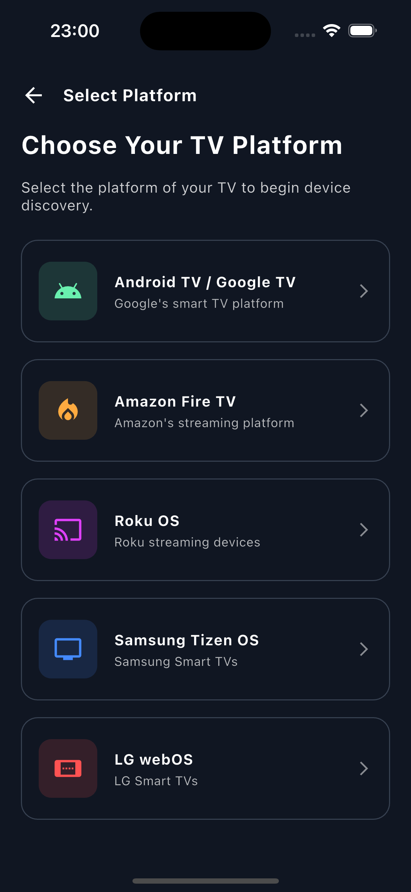
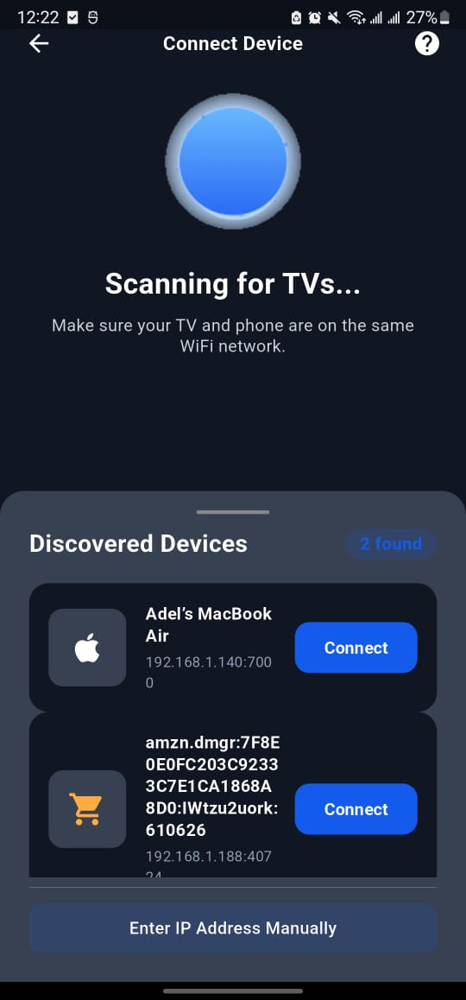
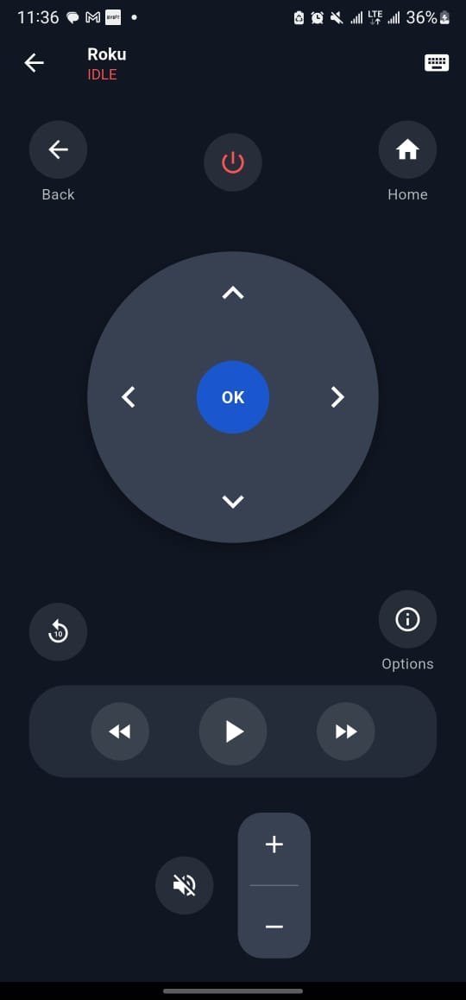

# UniversalRemote: Universal TV Remote

**UniversalRemote** is a high-reliability, senior-engineered Flutter application designed for deterministic control of Smart TV platforms over Wi-Fi. By utilizing **GetX** for reactive state management and platform-native control protocols, UniversalRemote eliminates the "ghost device" issues found in generic remote apps.


## 🏗️ Project Architecture

The codebase adheres to a strict **Modular Separation** requirement. Each platform integration is isolated to ensure that discovery and control logic for one brand (e.g., Fire TV) never interferes with another (e.g., Samsung Tizen).

## 📱 Screenshots

|                 Platform Selection                 |                 Device Discovery                 |            Remote Controller            |
|:--------------------------------------------------:|:------------------------------------------------:|:---------------------------------------:|
|  |  |  |
|             *Step 1: Select Platform*              |            *Step 2: Device Discovery*            |          *Step 3: Control UI*           |

### Directory Structure
```text
lib/
├── components/           # Reusable UI widgets (Buttons, Lists, Spacers)
├── controllers/          # GetX Controllers (Logic for FireTV, ADB, etc.)
├── helpers/              # Routes and utility functions
├── models/               # Platform-specific device data models
├── screens/
│   ├── discovery/        # Device discovery and validation UI
│   ├── intro/            # Onboarding and Platform Selection
│   └── remotes/          # Dedicated remote layouts per platform
├── services/             # Dialog, system, and storage services
└── theme/                # Global styling and color palettes
```

## 🧠 State Management (GetX)

UniversalRemote leverages **GetX** for high-performance, reactive state management. This ensures the UI stays synchronized with the underlying socket connections and ADB streams without unnecessary rebuilds.


### Connection Lifecycle
Each platform controller (e.g., `FireTVController`) implements a deterministic state machine to handle the volatile nature of network connections:

* **`IDLE`**: Initial state, no active connection.
* **`DISCOVERING`**: Actively listening for NSD/mDNS services matching the platform signature.
* **`CONNECTING`**: Initializing handshakes (e.g., ADB Authentication or WebSocket upgrade).
* **`CONNECTED`**: Session established; persistent shell or socket is active.
* **`RETRYING` / `FAILED`**: Automatic recovery logic for dropped packets or network switches.

## 🚀 Key Features

### 🎯 Deterministic Discovery
Unlike generic "LAN scanners" that flood your UI with printers, lightbulbs, and neighbors' phones, LastRemote uses **Platform-Scoped Discovery**. 
* **Scoped mDNS/NSD**: Actively listens only for service signatures matching the selected platform (e.g., `_amzn-wplay._tcp` for Fire TV).
* **Zero "Ghost" Devices**: Only hardware that explicitly identifies as a supported TV platform will ever appear in your list.

### 🛡️ The Validation Gate
Every discovered device must pass a background "Handshake Test" before it is presented to the user.
* **Port Verification**: Ensures the control port (e.g., `5555` for ADB) is open and responsive.
* **Handshake Success**: Validates that the device isn't just "present" but is actually "controllable."

### ⚡ Low-Latency Native Control
Engineered for a command execution target of **$\le 250\text{ms}$**. 
* **Persistent Sessions**: For platforms like Fire TV, the app maintains a persistent ADB shell stream to eliminate the overhead of creating a new connection for every button press.
* **Native KeyEvents**: Sends direct system-level commands (e.g., `input keyevent 66` for Enter) rather than simulating high-latency keyboard inputs.

### 🏗️ Modular "Clean" Architecture
The codebase is built on strict **Module Isolation**.
* **Zero Logic Leaks**: Discovery, pairing, and control logic for Samsung Tizen is physically and logically separated from LG webOS or Fire TV.
* **GetX Integration**: High-performance reactive state management ensures the UI stays in sync with connection states (`IDLE`, `CONNECTING`, `CONNECTED`, `FAILED`) in real-time.

### 🔒 Privacy-First Engineering
* **Local-Only Operation**: No data, credentials, or remote commands ever leave your local network.
* **Secure Storage**: Pairing tokens and sensitive device metadata are stored using OS-level encrypted secure storage.
* **Prohibition Compliance**: Strictly avoids prohibited behaviors like ARP spoofing, packet sniffing, or router admin access.
